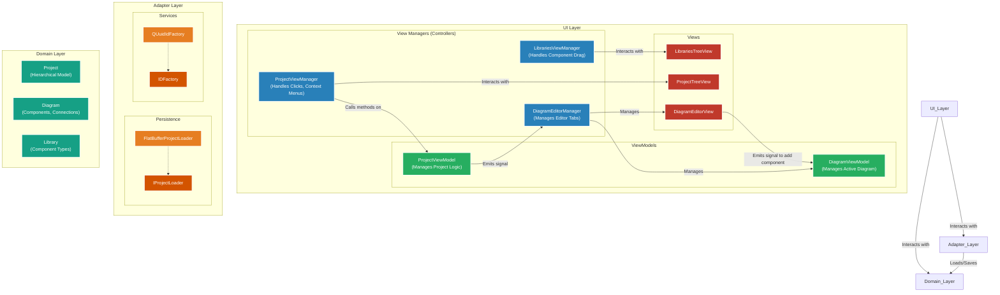

```mermaid
graph TD
    subgraph UI Layer
        subgraph "View Managers (Controllers)"
            PVM["ProjectViewManager<br>(Handles Clicks, Context Menus)"]
            LVM["LibrariesViewManager<br>(Handles Component Drag)"]
            DEM["DiagramEditorManager<br>(Manages Editor Tabs)"]
        end

        subgraph "ViewModels"
            PVM_VM["ProjectViewModel<br>(Manages Project Logic)"]
            DM_VM["DiagramViewModel<br>(Manages Active Diagram)"]
        end

        subgraph "Views"
            PV["ProjectTreeView"]
            LV["LibrariesTreeView"]
            DEV["DiagramEditorView"]
        end

        PVM -- Interacts with --> PV
        LVM -- Interacts with --> LV
        DEM -- Manages --> DEV
        DEM -- Manages --> DM_VM

        PVM -- Calls methods on --> PVM_VM
        PVM_VM -- Emits signal --> DEM
        DEV -- Emits signal to add component --> DM_VM
    end

    subgraph Adapter Layer
        direction LR
        subgraph "Persistence"
            PL["IProjectLoader"]
            FBPL["FlatBufferProjectLoader"] -.-> PL
        end
        subgraph "Services"
            IDF["IDFactory"]
            QIDF["QUuidIdFactory"] -.-> IDF
        end
    end

    subgraph Domain Layer
        direction LR
        PROJ["Project<br>(Hierarchical Model)"]
        DIAG["Diagram<br>(Components, Connections)"]
        LIB["Library<br>(Component Types)"]
    end

    %% Connections between layers
    UI_Layer -- Interacts with --> Adapter_Layer
    UI_Layer -- Interacts with --> Domain_Layer
    Adapter_Layer -- Loads/Saves --> Domain_Layer

    style PVM fill:#2980b9,stroke:#fff,stroke-width:2px,color:#fff
    style LVM fill:#2980b9,stroke:#fff,stroke-width:2px,color:#fff
    style DEM fill:#2980b9,stroke:#fff,stroke-width:2px,color:#fff
    style PVM_VM fill:#27ae60,stroke:#fff,stroke-width:2px,color:#fff
    style DM_VM fill:#27ae60,stroke:#fff,stroke-width:2px,color:#fff
    style PV fill:#c0392b,stroke:#fff,stroke-width:2px,color:#fff
    style LV fill:#c0392b,stroke:#fff,stroke-width:2px,color:#fff
    style DEV fill:#c0392b,stroke:#fff,stroke-width:2px,color:#fff

    style PL fill:#d35400,stroke:#fff,stroke-width:2px,color:#fff
    style FBPL fill:#e67e22,stroke:#fff,stroke-width:2px,color:#fff
    style IDF fill:#d35400,stroke:#fff,stroke-width:2px,color:#fff
    style QIDF fill:#e67e22,stroke:#fff,stroke-width:2px,color:#fff

    style PROJ fill:#16a085,stroke:#fff,stroke-width:2px,color:#fff
    style DIAG fill:#16a085,stroke:#fff,stroke-width:2px,color:#fff
    style LIB fill:#16a085,stroke:#fff,stroke-width:2px,color:#fff
```
