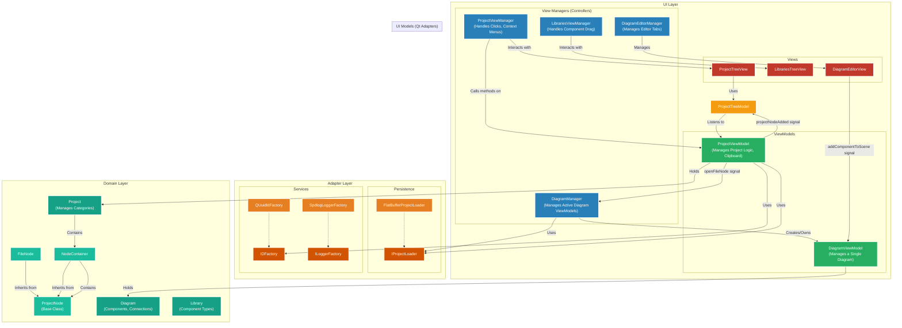

```mermaid
graph TD
    subgraph UI Layer
        subgraph "View Managers (Controllers)"
            PVM["ProjectViewManager<br>(Handles Clicks, Context Menus)"]
            LVM["LibrariesViewManager<br>(Handles Component Drag)"]
            DEM["DiagramEditorManager<br>(Manages Editor Tabs)"]
            DM["DiagramManager<br>(Manages Active Diagram ViewModels)"]
        end

        subgraph "ViewModels"
            PVM_VM["ProjectViewModel<br>(Manages Project Logic, Clipboard)"]
            DM_VM["DiagramViewModel<br>(Manages a Single Diagram)"]
        end

        subgraph "Views"
            PV["ProjectTreeView"]
            LV["LibrariesTreeView"]
            DEV["DiagramEditorView"]
        end

        PVM -- Interacts with --> PV
        LVM -- Interacts with --> LV
        DEM -- Manages --> DEV
        DM -- Creates/Owns --> DM_VM

        PVM -- Calls methods on --> PVM_VM
        PVM_VM -- projectNodeAdded signal --> PTreeM
        PVM_VM -- openFileNode signal --> DM
        DEV -- addComponentToScene signal --> DM_VM
    end

    subgraph "UI Models (Qt Adapters)"
        PTreeM["ProjectTreeModel"]
    end

    subgraph "Adapter Layer"
        direction LR
        subgraph "Persistence"
            PL["IProjectLoader"]
            FBPL["FlatBufferProjectLoader"] -.-> PL
        end
        subgraph "Services"
            IDF["IDFactory"]
            QIDF["QUuidIdFactory"] -.-> IDF
            LF["ILoggerFactory"]
            SLF["SpdlogLoggerFactory"] -.-> LF
        end
    end

    subgraph "Domain Layer"
        direction LR
        PROJ["Project<br>(Manages Categories)"]
        PN["ProjectNode<br>(Base Class)"]
        FN["FileNode"] -- Inherits from --> PN
        NC["NodeContainer"] -- Inherits from --> PN
        DIAG["Diagram<br>(Components, Connections)"]
        LIB["Library<br>(Component Types)"]

        PROJ -- Contains --> NC
        NC -- Contains --> PN
    end

    %% Connections between layers
    PVM_VM -- Uses --> PL
    PVM_VM -- Uses --> IDF
    PVM_VM -- Holds --> PROJ
    DM -- Uses --> PL
    DM_VM -- Holds --> DIAG

    PTreeM -- Listens to --> PVM_VM
    PV -- Uses --> PTreeM

    %% Style Definitions
    style PVM fill:#2980b9,stroke:#fff,stroke-width:2px,color:#fff
    style LVM fill:#2980b9,stroke:#fff,stroke-width:2px,color:#fff
    style DEM fill:#2980b9,stroke:#fff,stroke-width:2px,color:#fff
    style DM fill:#2980b9,stroke:#fff,stroke-width:2px,color:#fff

    style PVM_VM fill:#27ae60,stroke:#fff,stroke-width:2px,color:#fff
    style DM_VM fill:#27ae60,stroke:#fff,stroke-width:2px,color:#fff

    style PV fill:#c0392b,stroke:#fff,stroke-width:2px,color:#fff
    style LV fill:#c0392b,stroke:#fff,stroke-width:2px,color:#fff
    style DEV fill:#c0392b,stroke:#fff,stroke-width:2px,color:#fff

    style PTreeM fill:#f39c12,stroke:#fff,stroke-width:2px,color:#fff

    style PL fill:#d35400,stroke:#fff,stroke-width:2px,color:#fff
    style FBPL fill:#e67e22,stroke:#fff,stroke-width:2px,color:#fff
    style IDF fill:#d35400,stroke:#fff,stroke-width:2px,color:#fff
    style QIDF fill:#e67e22,stroke:#fff,stroke-width:2px,color:#fff
    style LF fill:#d35400,stroke:#fff,stroke-width:2px,color:#fff
    style SLF fill:#e67e22,stroke:#fff,stroke-width:2px,color:#fff

    style PROJ fill:#16a085,stroke:#fff,stroke-width:2px,color:#fff
    style PN fill:#1abc9c,stroke:#fff,stroke-width:2px,color:#fff
    style FN fill:#1abc9c,stroke:#fff,stroke-width:2px,color:#fff
    style NC fill:#1abc9c,stroke:#fff,stroke-width:2px,color:#fff
    style DIAG fill:#16a085,stroke:#fff,stroke-width:2px,color:#fff
    style LIB fill:#16a085,stroke:#fff,stroke-width:2px,color:#fff
```